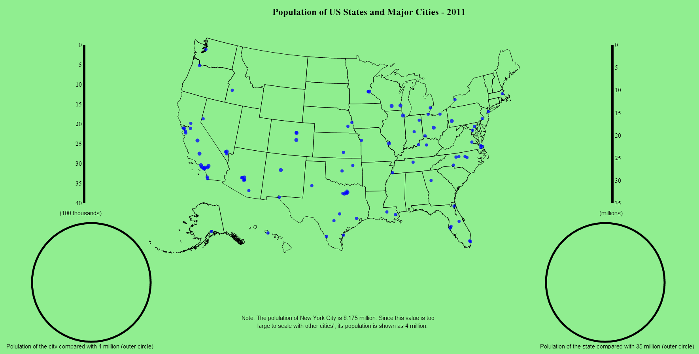
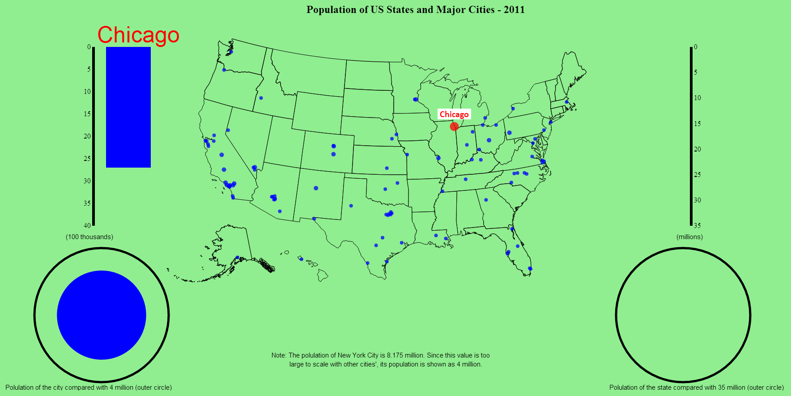
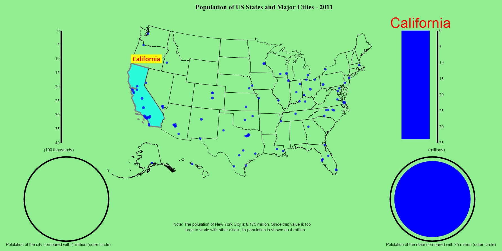

# Assignment 4 - Maps and Views

Project link: ["Population of US states and major cities - 2011"](http://arunvodc.github.io/04-MapsAndViews/index.html).

File Name        :  README.md

File Reference   :  index.html

Contributor      :  Arun Vadivel

Task             :  Maps and Views

Purpose of the File:

This is a JavaScript D3.js file created for demonstrating Maps and Views using D3.js. An interactive visualization is created for viewing the population of the United State's various states and major 100 cities in 2011.

Data:
1. us.json:
	This 'json' file downloaded from the web has the data for presenting the map of the United States.
2. city.csv:
	This file holds the data of major 100 cities in US with their population along with their latitude and location.
3. State data - An array in index.html:
	The population details of various states is present as an array in index.html file. The idea behind this approach is to learn to access data using function in D3.js.

Technical Achievements:

1. Linked different visualizations by passing data from one visualization to another.

2. Created an interactive visualization by creating animated data transitions when the mouse is moved over the desired location in the map.

3. Used minimal code for creating the visualization. Used fewer code to help anyone who wants to understand the code and modify in future.

4. Visualized real world data that actually helps people to understand a useful information.

Design Achievements:

1. Minimal colors used to avoid any distraction for the viewers and to have a pleasant experience.

2. Optimally sized and placed the visualizations in the screen for quick and easy understanding of the data required.

3. Detailed view of the data is presented whenever the user moves the mouse cursor over the city/state. The bar shows the population on a scale and the circle help the user to understand the volume of the population by displaying a circular area.

4. A "Note" placed at the bottom of the visualization to avoid the larger scale of New York City when compared with other cities. This helps the visualization of other cities to be shown in a good scale while telling the users that New York City alone has alone been scaled differently.

5. Well-presented city/state names in the visualization when moving the mouseover the city/state and also above the bar of each city/state.

Design Achievements:

1. Minimal colors used to avoid any distraction for the viewers and to have a pleasant experience.

2. Optimally sized and placed the visualizations in the screen for quick and easy understanding of the data required.

3. Detailed view of the data is presented whenever the user moves the mouse cursor over the city/state. The bar shows the population on a scale and the circle help the user to understand the volume of the population by displaying a circular area.

4. A "Note" placed at the bottom of the visualization to avoid the larger scale of New York City when compared with other cities. This helps the visualization of other cities to be shown in a good scale while telling the users that New York City alone has alone been scaled differently.

5. Well presented city/state names in the visualization and also above the bar of each city/state.

Screenshots:

Initial Map

Population of the City

Population of the State

[This is a link](http://arunvodc.github.io/04-MapsAndViews/index.html) to index.html.
