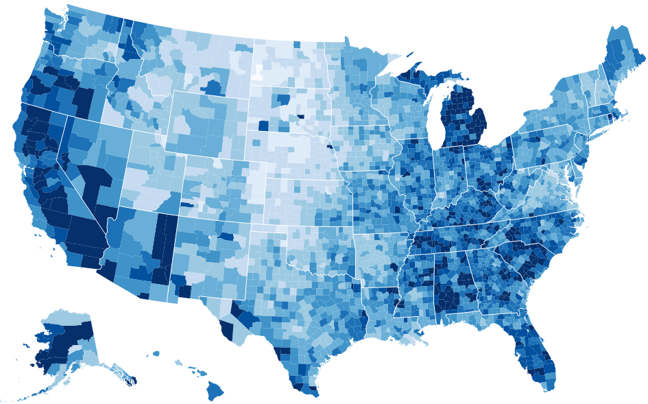
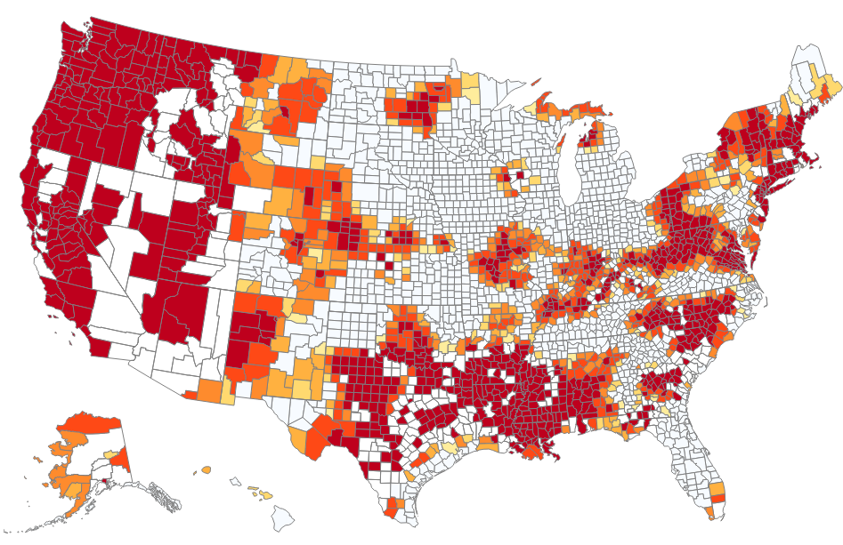

# Lab -- Maps

Link: [http://cs573-15f.github.io/lab-map/index.html](http://cs573-15f.github.io/lab-map/index.html)

Team:

- Lane Harrison, codementum
- Hane Larrison, modecentum

Nearly everyone is familiar with maps-- they are perhaps the oldest form of visualization. 

Effectively showing data using maps can be difficult, however.

In this lab you'll get to recreate a map, substitute in a new dataset, and change the color/style of the map to better communicate the data.

Begin with the code/data of [this map](http://bl.ocks.org/mbostock/4060606), which shows unemployment in each county in the United States.

Notice the structure of the data.
The `id` column are the same IDs used by the [US Census](https://www.census.gov/geo/reference/codes/cou.html).

Using the code as a starting point, visualize the drought.csv data included in this repo.

There are multiple columns in the drought dataset, which is from the [US Drought Monitor](http://droughtmonitor.unl.edu/MapsAndData/DataTables.aspx).
Figure out what the columns mean and decide how best to visualize them.
You'll want to change the color scale.
Because you have multiple values per county, you'll want to devise a scheme for combining columns (either in the data or via opacity on the map), or possibly adding interaction/animation to switch between the columns, or maybe even including multiple maps.

Below is one example:

Also feel free to experiment with interaction, mouseovers, or any other technique that helps show the data.

## References

- The drought data idea and example map come from [Bob Rudis](https://twitter.com/hrbrmstr)
- [Lets Make A Map](http://bost.ocks.org/mike/map/)
- [Interactive and Multivariate Choropleth Maps with D3
](http://www.cartographicperspectives.org/index.php/journal/article/view/cp78-sack-et-al/1359)
